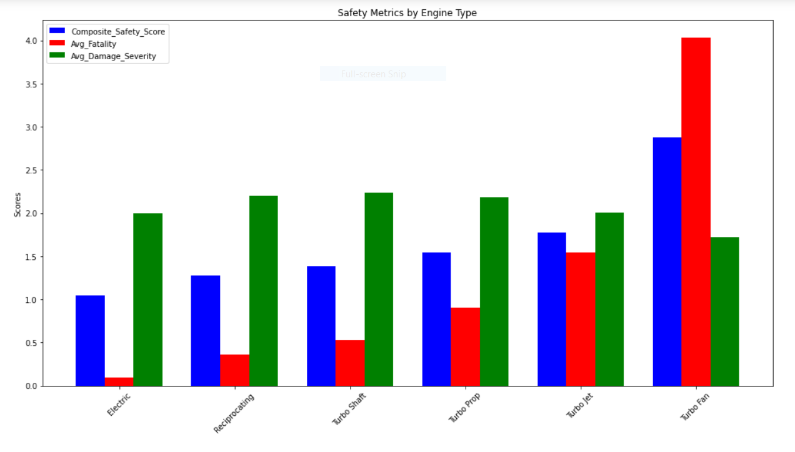
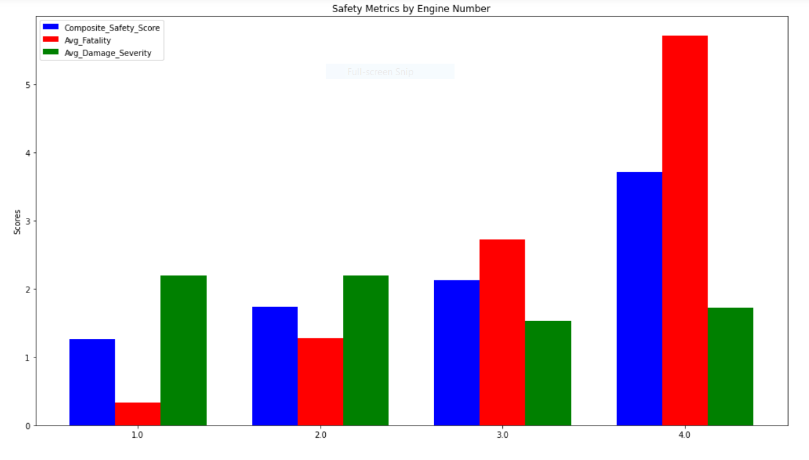
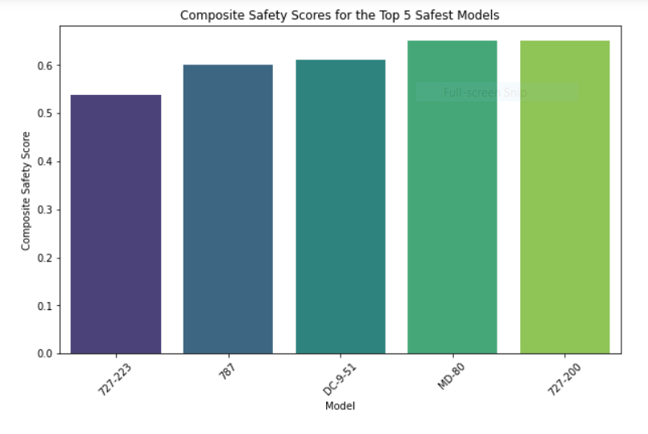

# Aircraft Safety Analysis Project

## Overview
This project aims to enhance aircraft safety by evaluating various aircraft and aircraft configurations in regard to their associated risks. Utilizing historical data, the analysis identifies the safest aircraft models, engine types, and engine counts, providing important insights for making informed decisions in entering into the aviation industry.

## Business Understanding

### Purpose
The Aircraft Safety Analysis Project is designed to provide insights into the safety performance of different aircraft configurations, with a focus on aiding aviation companies and potential investors in making well-informed decisions regarding aircraft purchases. The project aims to improve safety and cost-effectiveness in the aviation industry, directly benefitting companies entering into the aviation industry as well as those already in the industry. 

### Stakeholders
The primary stakeholders for this project include:
- **Aviation Companies:** Operators of commercial and private aircraft who are directly impacted by the safety performance of the aircraft they own and operate.
- **Aircraft Manufacturers:** Companies that design and build aircraft who are interested in improving safety features and the marketability of their models based on historical safety data.
- **Investment Firms:** Financial companies that invest in aviation assets and companies and are interested in risk management and performance.
- **Regulatory Bodies:** Government and international organizations that regulate aviation safety standards and practices.

### Key Business Questions
To address the concerns of these stakeholders, the project seeks to answer several critical business questions:
1. **Which aircraft models demonstrate the lowest safety risk in terms of past incidents and accidents?**
2. **How do different engine types and the number of engines influence the safety outcomes of aircraft?**
3. **Which aircraft configurations have had the least damage in the event of aviation accidents or incidents?**

## Data Understanding and Analysis

### Data Collection
The dataset used in this project was sourced from Kaggle.com, specifically the NTSB (National Transportation Safety Board) aviation accident database. This dataset contains detailed records of aviation accidents and incidents.
- [NTSB Dataset on Kaggle](https://www.kaggle.com/datasets/khsamaha/aviation-accident-database-synopses)

### Data Cleaning
Data relevant to the analysis included variables such as total fatal injuries, aircraft damage, model, engine type, and number of engines. The following steps were taken in the data cleaning process:
- Standardization: Relevant columns were standardized for type casing and spacing.
- Imputations: Null values were imputed using related columns where possible; otherwise, rows with missing necessary values were removed.
- Damage Severity: Aircraft damage descriptions were converted into a numerical scale (1 - Minor, 2 - Substantial, 3 - Destroyed) and recorded in a new column titled 'Damage Severity'.

### Data Analysis
The analysis employed descriptive statistics to assess the safety of different aircraft configurations. Key metrics analyzed included:
- **Average Fatalities and Damage Severity:** Calculated for each engine type, number of engines, and aircraft model.
- **Composite Safety Score:** Created by averaging the damage severity and fatalities scores to rank the configurations from safest to least safe.

## Visualizations

### Visualization 1: Engine Type Analysis
This visualization displays the average fatalities, average damage severity, and composite safety scores for each engine type, demonstrating the superior safety of electric and reciprocating engines.

### Visualization 2: Number of Engines Analysis
This visualization shows the safety metrics (average fatalities, damage severity, and composite safety score) across different numbers of engines, showing the safest engine number configurations.

### Visualization 3: Top 5 Safest Models
This visualization ranks the top 5 safest models based on their composite safety scores, illustrating which models are statistically the safest.

## Results
Key findings from my analysis include:
- **Engine Types:** Electric and Reciprocating engines are identified as the safest, though data on electric engines is limited.
- **Number of Engines:** Aircraft with a single engine have the lowest average fatalities, while those with three engines show the least average damage severity. Single engine aircraft also have best overall safety score as well. 
- **Safest Models:** The models with the lowest composite safety scores, indicating higher safety, are 727-223, 787, DC-9-51, MD-80, and 727-200.

## Recommendations
Based on the analysis, the following recommendations are made:
- **Single-Engine and Reciprocating Engines:** Focus on acquiring single-engine aircraft equipped with reciprocating engines due to their proven safety.
- **Exploration of Electric Engines:** Further research and data collection are recommended for electric engines to fully evaluate their safety potential.
- **Incorporate Top Models:** It is advised to consider the top models identified through the analysis (727-223, 787, DC-9-51, MD-80, 727-200) in future aircraft acquisitions.

## Presentation and Dashboard
Explore the insights and recommendations through our detailed presentation and interactive Tableau dashboard:

- **Presentation**: For a detailed walkthrough of the project findings, visit the [Google Slides Presentation](https://docs.google.com/presentation/d/1OPgq_DwyhoCFpDjN7gu_xMS352ci8Rzjs7JX0JF4os8/edit?usp=sharing).
- **Tableau Dashboard**: Here you can interact with the visualizations that support my analysis on [Tableau Public](https://public.tableau.com/app/profile/alexander.gambino/viz/Phase1Final/Dashboard1?publish=yes).

## Instructions for Navigating the Repository
This repository is organized into several sections to help users quickly find resources and understand the project structure:

- **`images/`**: Contains visualization images used throughout the README and presentations.
- **`README.md`**: Offers a detailed overview of the project including analysis insights and conclusions.
- **`Phase1 Revised Project.ipynb`**: The main Jupyter notebook with all project code for data cleaning, analysis, and visualizations.
- **`Aviation_Data.csv`**: The raw dataset used in this analysis.
- **`.gitignore`**: Lists all files and directories ignored by Git.
